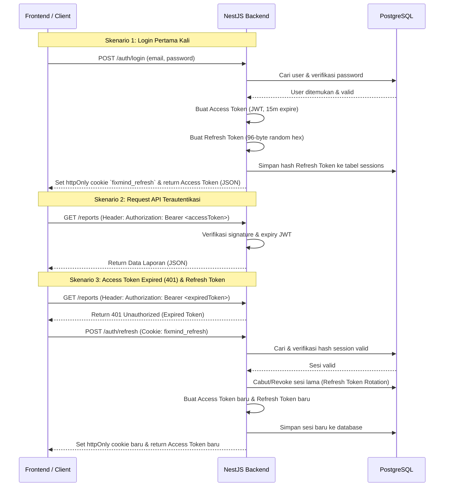

# FixMind — API Documentation

Base URL: `http://localhost:3000/api/v1`

Semua endpoint yang membutuhkan autentikasi wajib menyertakan header:
```
Authorization: Bearer <accessToken>
```

## Response Format

### Success
```json
{
  "success": true,
  "message": "Login successful",
  "data": { }
}
```

### Error
```json
{
  "success": false,
  "message": "Validation failed",
  "errors": [{ "field": "email", "message": "email must be an email" }]
}
```

---

## Authentication

Refresh token disimpan di **httpOnly cookie** `fixmind_refresh` pada path `/api/v1/auth`.

Access token dikembalikan di JSON dan dikirim sebagai `Authorization: Bearer <token>`.

### Token Authentication Flow



### POST /auth/login
**Public** | Login

**Body:**
```json
{ "email": "admin@fixmind.local", "password": "Admin123!@#" }
```

**Response data:**
```json
{
  "user": { "id": "...", "email": "...", "fullName": "...", "role": "ADMIN" },
  "accessToken": "eyJ...",
  "expiresIn": "15m"
}
```

### POST /auth/refresh
**Public** | Refresh access token (menggunakan cookie)

### POST /auth/logout
**Authenticated** | Cabut sesi, hapus cookie

### GET /auth/me
**Authenticated** | Profil pengguna yang sedang login

---

## Health

### GET /health
**Public** | Cek status server API

---

## Users

| Method | Path | Role | Deskripsi |
|--------|------|------|-----------|
| `GET` | `/users` | ADMIN | Daftar semua pengguna |
| `GET` | `/users/technicians` | ADMIN | Daftar teknisi aktif |
| `POST` | `/users` | ADMIN | Buat pengguna baru |
| `PATCH` | `/users/:id` | ADMIN | Update data pengguna |
| `DELETE` | `/users/:id` | ADMIN | Hapus pengguna |

---

## Rooms (Ruangan)

| Method | Path | Role | Deskripsi |
|--------|------|------|-----------|
| `GET` | `/rooms` | Authenticated | Daftar semua ruangan |
| `GET` | `/rooms/:id` | Authenticated | Detail ruangan |
| `POST` | `/rooms` | ADMIN | Tambah ruangan baru |
| `PATCH` | `/rooms/:id` | ADMIN | Update ruangan |
| `DELETE` | `/rooms/:id` | ADMIN | Hapus ruangan |

---

## Assets (Aset Inventaris)

| Method | Path | Role | Deskripsi |
|--------|------|------|-----------|
| `GET` | `/assets` | Authenticated | Daftar aset (opsional: `?roomId=<uuid>`) |
| `GET` | `/assets/:id` | Authenticated | Detail aset |
| `POST` | `/assets` | ADMIN | Tambah aset manual |
| `PATCH` | `/assets/:id` | ADMIN | Update aset |
| `DELETE` | `/assets/:id` | ADMIN | Hapus aset (soft delete) |
| `GET` | `/assets/import/template` | ADMIN | Download template Excel untuk import |
| `POST` | `/assets/import?roomId=<uuid>` | ADMIN | Import aset dari file Excel |

### Body POST /assets
```json
{
  "roomId": "uuid-ruangan",
  "idpemda": "1.3.2.01.10.001",
  "kodeBarang": "KMP-001",
  "nomorRegister": "REG-2024-001",
  "namaBarang": "Kursi Pimpinan",
  "merkType": "Chitose / Type-A"
}
```

### Import Excel (POST /assets/import)
- **Content-Type:** `multipart/form-data`
- **Query param:** `roomId` (UUID ruangan tujuan) — **wajib**
- **Form field:** `file` — file `.xlsx` atau `.xls`

**Kolom Excel yang wajib ada di baris header:**

| Nama Kolom | Alias yang Diterima |
|------------|---------------------|
| `idpemda` | `id_pemda` |
| `kode_barang` | `kode_brg` |
| `nomor_register` | `no_register`, `no_reg` |
| `nama_barang` | `nama_brg` |
| `merk_type` | `merk_dan_type`, `merk_tipe`, `merk_dan_tipe`, `merk` |

**Response:**
```json
{
  "success": true,
  "message": "Assets imported",
  "data": {
    "imported": 10,
    "data": [ { "id": "...", "kodeBarang": "...", ... } ]
  }
}
```

> **Upsert:** Jika `kode_barang` sudah ada di database, baris tersebut akan **diperbarui** (bukan duplikat).

---

## Reports (Laporan)

| Method | Path | Role | Deskripsi |
|--------|------|------|-----------|
| `GET` | `/reports` | Authenticated | Daftar laporan (filter: `status`, `roomId`, `dateFrom`, `dateTo`) |
| `GET` | `/reports/:id` | Authenticated | Detail laporan beserta riwayat & lampiran |
| `POST` | `/reports` | USER, ADMIN | Buat laporan baru |
| `PATCH` | `/reports/:id/status` | TECHNICIAN, ADMIN | Update status laporan |
| `POST` | `/reports/:id/assign` | ADMIN | Tugaskan teknisi |
| `POST` | `/reports/:id/attachments` | USER, TECHNICIAN | Upload foto (multipart) |
| `GET` | `/reports/:id/comments` | Authenticated | Ambil komentar laporan |
| `POST` | `/reports/:id/comments` | Authenticated | Tambah komentar |
| `GET` | `/reports/export/excel` | ADMIN | Export laporan ke Excel |
| `GET` | `/reports/export/pdf` | ADMIN | Export laporan ke PDF |

---

## Maintenance (Jadwal Pemeliharaan)

| Method | Path | Role | Deskripsi |
|--------|------|------|-----------|
| `GET` | `/maintenance` | Authenticated | Daftar jadwal (filter: `status`, `technicianId`) |
| `POST` | `/maintenance` | ADMIN | Buat jadwal pemeliharaan |
| `PATCH` | `/maintenance/:id/status` | TECHNICIAN, ADMIN | Update status jadwal |
| `DELETE` | `/maintenance/:id` | ADMIN | Hapus jadwal |

---

## Analytics

| Method | Path | Role | Deskripsi |
|--------|------|------|-----------|
| `GET` | `/analytics/overview` | ADMIN | Ringkasan dashboard (laporan aktif, dll) |
| `GET` | `/analytics/summary` | ADMIN | Statistik lengkap dengan breakdown |
| `GET` | `/analytics/technician-stats` | ADMIN | Statistik performa teknisi |
| `GET` | `/analytics/export` | ADMIN | Export data analitik |

---

## AI

| Method | Path | Role | Deskripsi |
|--------|------|------|-----------|
| `POST` | `/ai/chat` | Authenticated | Chat dengan AI asisten |

**Body:**
```json
{ "prompt": "Bagaimana cara merawat AC agar tidak cepat rusak?" }
```

---

## Error Catalog & HTTP Status Codes

FixMind menggunakan kode status HTTP standar dikombinasikan dengan pesan kesalahan terstruktur untuk memudahkan penanganan error pada sisi client.

### Struktur Response Error
Setiap terjadi kesalahan, API akan mengembalikan format berikut:
```json
{
  "success": false,
  "message": "Pesan deskripsi kesalahan dalam bahasa Inggris",
  "errors": [
    {
      "field": "nama_field_yang_bermasalah",
      "message": "Detail pesan validasi"
    }
  ]
}
```

### Katalog Kesalahan Umum (Error Catalog)

| HTTP Status | Pesan Error (`message`) | Skenario / Penyebab |
|-------------|-------------------------|---------------------|
| **400 Bad Request** | `Validation failed` | Payload DTO tidak lengkap atau tidak sesuai dengan aturan `class-validator` (misal: format email salah). |
| **401 Unauthorized** | `Invalid credentials` | Email tidak terdaftar, password salah, atau akun dinonaktifkan (`is_active = false`). |
| **401 Unauthorized** | `Account locked. Please try again in X minutes.` | Akun terkunci sementara karena 5 kali berturut-turut memasukkan password yang salah. |
| **401 Unauthorized** | `Too many failed attempts. Account locked for 15 minutes.` | Tepat pada percobaan ke-5 yang gagal, pesan ini dikembalikan dan akun langsung dikunci. |
| **401 Unauthorized** | `Invalid refresh token` | Refresh token pada cookie tidak valid, telah kedaluwarsa, atau sudah pernah digunakan/dicabut. |
| **403 Forbidden** | `Forbidden resource` | Pengguna tidak memiliki peran (Role) yang sesuai dengan guard `@Roles()` pada endpoint tersebut. |
| **404 Not Found** | `Report not found` / `Asset not found` | ID data (UUID) yang diminta tidak ditemukan di database. |
| **409 Conflict** | `Email already registered` | Mencoba melakukan registrasi akun baru dengan email yang sudah terdaftar. |
| **429 Too Many Requests** | `ThrottlerException: Too Many Requests` | Melebihi batas ambang rate limiter (default: 100 request/menit per IP). |
| **500 Internal Server Error** | `Internal server error` | Terjadi kesalahan tidak terduga pada server/database (log *stack trace* dicatat di server). |

---

## WebSockets (Real-time Notification Events)

Aplikasi FixMind menggunakan **Socket.IO** untuk mengirimkan pembaruan data secara langsung (*real-time*) kepada pengguna dan administrator.

### Sambungan & Autentikasi
Koneksi WebSocket dilakukan ke URL server utama (`http://localhost:3000`) dengan menyertakan token akses JWT dalam objek autentikasi handshake:

```javascript
import { io } from 'socket.io-client';

const socket = io('http://localhost:3000', {
  auth: {
    token: accessToken // Access Token JWT dari login
  }
});
```

### Rooms (Ruangan Socket)
* **`admins`:** Semua socket milik pengguna dengan role `ADMIN` akan dimasukkan ke ruangan `admins` saat pertama kali berhasil terhubung. Hal ini memungkinkan pengiriman notifikasi terarah hanya untuk admin secara instan.

### Katalog Event yang Dipancarkan (Emitted Events)

Sisi server akan memancarkan event-event berikut ke client:

#### 1. `report.created`
Dipancarkan ketika pengguna berhasil membuat laporan baru.
* **Penerima:** Seluruh socket di room `admins`.
* **Payload:** Objek detail laporan baru yang dibuat (`ReportListRow`).

#### 2. `report.updated`
Dipancarkan ketika status laporan berubah (misal: dari `PENDING` menjadi `IN_PROGRESS` atau `COMPLETED`).
* **Penerima:** Seluruh socket di room `admins` **DAN** semua socket milik pengguna pembuat laporan tersebut (`reporterId`).
* **Payload:** Objek detail laporan ter-update (`ReportListRow`).
