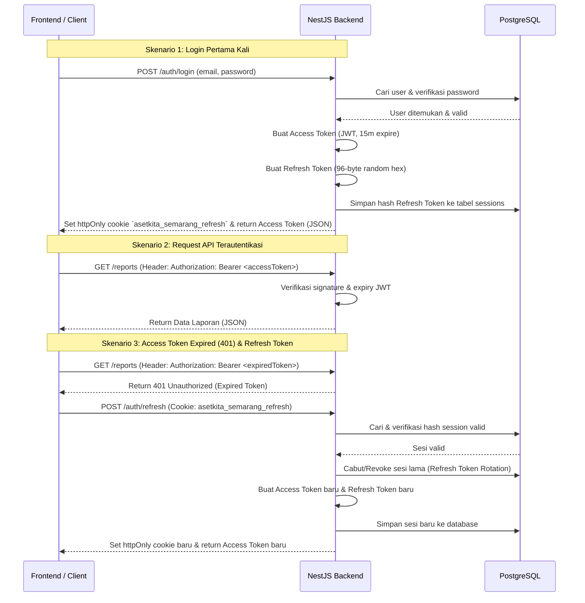

# ASETKITA Semarang — Dokumentasi API & Integrasi Endpoint

URL Utama (Base URL): `http://localhost:3000/api/v1`

---

## Otentikasi API & Contoh cURL

Semua endpoint yang membutuhkan autentikasi wajib menyertakan header:
```http
Authorization: Bearer <accessToken>
```

Berikut adalah contoh lengkap alur autentikasi menggunakan `cURL` (dapat disalin untuk dicoba langsung di terminal atau di-import ke Postman):

### 1. Login Pertama Kali (Mendapatkan Access Token & Set Cookie)
Kirim request `POST` ke `/auth/login` dengan email dan password. Server akan memvalidasi kredensial, mengembalikan access token dalam JSON, serta menyetel HttpOnly cookie `asetkita_semarang_refresh`.

**Request cURL:**
```bash
curl -X POST http://localhost:3000/api/v1/auth/login \
  -H "Content-Type: application/json" \
  -c cookies.txt \
  -d '{
    "email": "admin@asetkita-semarang.local",
    "password": "Admin123!@#"
  }'
```
*Catatan: Parameter `-c cookies.txt` akan menyimpan cookie refresh token yang dikirim backend ke file lokal.*

**Response:**
```json
{
  "success": true,
  "message": "Login successful",
  "data": {
    "user": {
      "id": "8a83dc53-c9cf-41c6-99b8-3e478eb079c6",
      "email": "admin@asetkita-semarang.local",
      "fullName": "Administrator",
      "role": "ADMIN"
    },
    "accessToken": "eyJhbGciOiJIUzI1NiIsIn...",
    "expiresIn": "15m"
  }
}
```

### 2. Mengakses Endpoint Terproteksi (Menggunakan Bearer Token)
Gunakan `accessToken` yang diperoleh dari respon login di atas pada header `Authorization`.

**Request cURL (Mendapatkan Daftar Laporan):**
```bash
curl -X GET http://localhost:3000/api/v1/reports \
  -H "Authorization: Bearer <accessToken>" \
  -H "Accept: application/json"
```

**Request cURL (Membuat Laporan Baru):**
```bash
curl -X POST http://localhost:3000/api/v1/reports \
  -H "Authorization: Bearer <accessToken>" \
  -H "Content-Type: application/json" \
  -d '{
    "title": "AC Bocor di Ruang Rapat",
    "description": "AC nomor 2 mengeluarkan air terus-menerus.",
    "roomId": "013dc06e-8260-496a-b2b7-a365df3586aa"
  }'
```

### 3. Menyinkronkan Ulang Token (Refresh Token Rotation)
Jika access token kedaluwarsa (HTTP status 401), panggil endpoint `/auth/refresh` dengan menyertakan cookie `asetkita_semarang_refresh` yang disimpan sebelumnya.

**Request cURL:**
```bash
curl -X POST http://localhost:3000/api/v1/auth/refresh \
  -b cookies.txt \
  -c cookies.txt
```
*Catatan: `-b cookies.txt` mengirimkan cookie yang disimpan sebelumnya, dan `-c cookies.txt` menulis ulang cookie baru hasil rotasi token refresh.*

**Response:**
```json
{
  "success": true,
  "message": "Token refreshed",
  "data": {
    "accessToken": "eyJhbGciOiJIUzI1NiIsIn...",
    "expiresIn": "15m"
  }
}
```

### 4. Logout (Mencabut Sesi)
Kirim request `POST` ke `/auth/logout` untuk menghapus sesi aktif di database dan membersihkan cookie refresh token.

**Request cURL:**
```bash
curl -X POST http://localhost:3000/api/v1/auth/logout \
  -H "Authorization: Bearer <accessToken>" \
  -b cookies.txt
```

---

## Format Respon Standar (API Envelope)

### Format Respon Berhasil (Success)
```json
{
  "success": true,
  "message": "Login successful",
  "data": { }
}
```

### Format Respon Galat (Error)
```json
{
  "success": false,
  "message": "Validation failed",
  "errors": [{ "field": "email", "message": "email must be an email" }]
}
```

---

## Modul Otentikasi (Auth)

Refresh token disimpan di **httpOnly cookie** `asetkita_semarang_refresh` pada path `/api/v1/auth`. Access token dikembalikan dalam format JSON dan dikirim via `Authorization: Bearer <token>`.

### Diagram Alur Token Authentication


```mermaid
sequenceDiagram
    participant Client as Frontend / Client
    participant API as NestJS Backend
    participant DB as PostgreSQL

    Note over Client, API: Skenario 1: Login Pertama Kali
    Client->>API: POST /auth/login (email, password)
    API->>DB: Cari user & verifikasi password
    DB-->>API: User ditemukan & valid
    API->>API: Buat Access Token (JWT, 15m expire)
    API->>API: Buat Refresh Token (96-byte random hex)
    API->>DB: Simpan hash Refresh Token ke tabel sessions
    API-->>Client: Set httpOnly cookie `asetkita_semarang_refresh` & return Access Token (JSON)

    Note over Client, API: Skenario 2: Request API Terautentikasi
    Client->>API: GET /reports (Header: Authorization: Bearer <accessToken>)
    API->>API: Verifikasi signature & expiry JWT
    API-->>Client: Return Data Laporan (JSON)

    Note over Client, API: Skenario 3: Access Token Expired (401) & Refresh Token
    Client->>API: GET /reports (Header: Authorization: Bearer <expiredToken>)
    API-->>Client: Return 401 Unauthorized (Expired Token)
    Client->>API: POST /auth/refresh (Cookie: asetkita_semarang_refresh)
    API->>DB: Cari & verifikasi hash session valid
    DB-->>API: Sesi valid
    API->>DB: Cabut/Revoke sesi lama (Refresh Token Rotation)
    API->>API: Buat Access Token baru & Refresh Token baru
    API->>DB: Simpan sesi baru ke database
    API-->>Client: Set httpOnly cookie baru & return Access Token baru
```

| Method | Path | Akses | Deskripsi |
|--------|------|-------|-----------|
| `POST` | `/auth/register` | Publik | Registrasi akun pengguna baru & otomatis login |
| `POST` | `/auth/login` | Publik | Login pengguna |
| `POST` | `/auth/refresh` | Publik | Refresh access token via cookie |
| `POST` | `/auth/logout` | Terautentikasi | Cabut sesi & bersihkan cookie |
| `GET` | `/auth/me` | Terautentikasi | Profil pengguna yang sedang login |
| `PATCH` | `/auth/profile` | Terautentikasi | Perbarui data nama & nomor telepon profil mandiri |
| `POST` | `/auth/profile/avatar` | Terautentikasi | Unggah berkas gambar untuk foto avatar profil |
| `DELETE` | `/auth/profile/avatar` | Terautentikasi | Hapus foto avatar profil (reset ke null) |
| `POST` | `/auth/change-password` | Terautentikasi | Ubah kata sandi profil mandiri |

---

## Modul Health Check

| Method | Path | Akses | Deskripsi |
|--------|------|-------|-----------|
| `GET` | `/health` | Publik | Cek status kesehatan server API |

---

## Modul Pengguna (Users)

| Method | Path | Peran Akses | Deskripsi |
|--------|------|-------------|-----------|
| `GET` | `/users` | ADMIN | Daftar semua akun pengguna (`?page=1&limit=20&isAdmin=true`) |
| `GET` | `/users/:id` | ADMIN | Detail data akun pengguna tertentu |
| `POST` | `/users` | ADMIN | Buat akun pengguna baru |
| `PATCH` | `/users/:id` | ADMIN | Perbarui data / status pengguna |
| `DELETE` | `/users/:id` | ADMIN | Hapus akun pengguna |

---

## Modul Ruangan (Rooms)

| Method | Path | Peran Akses | Deskripsi |
|--------|------|-------------|-----------|
| `GET` | `/rooms` | Terautentikasi | Daftar semua ruangan |
| `GET` | `/rooms/:id` | Terautentikasi | Detail data ruangan |
| `POST` | `/rooms` | ADMIN | Tambah ruangan baru |
| `PATCH` | `/rooms/:id` | ADMIN | Perbarui data ruangan |
| `DELETE` | `/rooms/:id` | ADMIN | Hapus ruangan |

---

## Modul Aset (Assets)

| Method | Path | Peran Akses | Deskripsi |
|--------|------|-------------|-----------|
| `GET` | `/assets` | Terautentikasi | Daftar aset (`?roomId=<uuid>&search=<query>&page=1&limit=50`) |
| `GET` | `/assets/:id` | Terautentikasi | Detail data aset |
| `POST` | `/assets` | ADMIN | Tambah aset manual |
| `PATCH` | `/assets/:id` | ADMIN | Perbarui data aset |
| `DELETE` | `/assets/:id` | ADMIN | Hapus aset (soft delete) |
| `GET` | `/assets/import/template` | ADMIN | Download template Excel import aset |
| `POST` | `/assets/import?roomId=<uuid>` | ADMIN | Import aset dari file Excel massal |
| `GET` | `/assets/transfers` | Terautentikasi | Daftar pengajuan transfer (`?status=<enum>&mineOnly=true`) |
| `GET` | `/assets/transfers/:id` | Terautentikasi | Detail pengajuan transfer aset |
| `POST` | `/assets/transfers` | Terautentikasi | Buat pengajuan transfer aset baru |
| `PATCH` | `/assets/transfers/:id` | ADMIN | Persetujuan/penolakan transfer aset |

### Body POST /assets (Tambah Aset Manual)
```json
{
  "roomId": "uuid-ruangan",
  "idpemda": "1.3.2.01.10.001",
  "kodeBarang": "KMP-001",
  "nomorRegister": "REG-2024-001",
  "namaBarang": "Kursi Pimpinan",
  "merkType": "Chitose / Type-A"
}
```

### Import Excel (POST /assets/import)
- **Content-Type:** `multipart/form-data`
- **Query param:** `roomId` (UUID ruangan tujuan) — **Wajib**
- **Form field:** `file` — Berkas `.xlsx` atau `.xls`

**Kolom Excel yang wajib ada di baris header:**

| Nama Kolom Utama | Alias yang Diterima |
|------------------|---------------------|
| `idpemda` | `id_pemda` |
| `kode_barang` | `kode_brg` |
| `nomor_register` | `no_register`, `no_reg` |
| `nama_barang` | `nama_brg` |
| `merk_type` | `merk_dan_type`, `merk_tipe`, `merk_dan_tipe`, `merk` |

### Body POST /assets/transfers (Pengajuan Transfer Aset)
```json
{
  "assetId": "uuid-aset-yang-dipindahkan",
  "toRoomId": "uuid-ruang-tujuan",
  "reason": "AC dipindahkan karena ruangan lama di-renovasi"
}
```

---

## Modul Laporan Kerusakan (Reports)

| Method | Path | Peran Akses | Deskripsi |
|--------|------|-------------|-----------|
| `GET` | `/reports` | Terautentikasi | Daftar laporan (`?status=<enum>&roomId=<uuid>&search=<query>&dateFrom=2026-07-01&dateTo=2026-07-31`) |
| `GET` | `/reports/:id` | Terautentikasi | Detail laporan beserta riwayat audit & lampiran foto |
| `POST` | `/reports` | USER, ADMIN | Buat tiket laporan kerusakan baru |
| `PATCH` | `/reports/:id/status` | ADMIN | Update status pengerjaan laporan |
| `POST` | `/reports/:id/attachments` | USER, ADMIN | Upload foto kerusakan/perbaikan (multipart) |
| `GET` | `/reports/:id/comments` | Terautentikasi | Ambil daftar komentar laporan |
| `POST` | `/reports/:id/comments` | Terautentikasi | Tambah komentar baru |
| `GET` | `/reports/export/excel` | ADMIN | Export data laporan ke Excel |
| `GET` | `/reports/export/pdf` | ADMIN | Export data laporan ke PDF |

---

## Modul Jadwal Pemeliharaan (Maintenance)

| Method | Path | Peran Akses | Deskripsi |
|--------|------|-------------|-----------|
| `GET` | `/maintenance` | Terautentikasi | Daftar jadwal pemeliharaan (`?status=<enum>&search=<query>`) |
| `GET` | `/maintenance/:id` | Terautentikasi | Detail agenda pemeliharaan |
| `POST` | `/maintenance` | ADMIN | Buat jadwal pemeliharaan baru |
| `PATCH` | `/maintenance/:id` | ADMIN | Perbarui data pemeliharaan |
| `PATCH` | `/maintenance/:id/status` | ADMIN | Update status/catatan realisasi pemeliharaan |
| `DELETE` | `/maintenance/:id` | ADMIN | Hapus jadwal pemeliharaan |

### Body POST /maintenance (Buat Jadwal Pemeliharaan Baru)
```json
{
  "roomId": "uuid-ruang-opsional",
  "assetId": "uuid-aset-opsional",
  "title": "Service AC Ruang Rapat Utama",
  "description": "Pembersihan rutin filter AC dan tambah freon jika diperlukan",
  "frequency": "MONTHLY",
  "scheduledDate": "2026-07-25",
  "status": "SCHEDULED",
  "assigneeType": "EXTERNAL_VENDOR",
  "assigneeName": "CV. Sejuk Jaya Pratama",
  "vendorContactName": "Pak Joko",
  "vendorPhone": "08123456789",
  "estimatedCost": 350000,
  "notes": "Hubungi pak Joko H-1 pengerjaan"
}
```

---

## Modul Analitik (Analytics)

| Method | Path | Peran Akses | Deskripsi |
|--------|------|-------------|-----------|
| `GET` | `/analytics/overview` | Terautentikasi | Ringkasan dasbor (metrik laporan aktif, dll. Berbeda untuk USER dan ADMIN) |
| `GET` | `/analytics/summary` | ADMIN | Statistik lengkap dengan rincian status |
| `GET` | `/analytics/export` | ADMIN | Export data analitik ke CSV |

---

## Katalog Kode Status HTTP Error (Error Catalog)

| HTTP Status | Pesan Error (`message`) | Skenario / Penyebab Utama |
|-------------|-------------------------|---------------------------|
| **400 Bad Request** | `Validation failed` | Request Body DTO tidak lengkap atau tidak sesuai aturan `class-validator`. |
| **401 Unauthorized** | `Invalid credentials` | Email tidak terdaftar, password salah, atau akun dinonaktifkan (`is_active = false`). |
| **401 Unauthorized** | `Account locked. Please try again in 15 minutes.` | Akun terkunci sementara akibat 5x gagal memasukkan password berturut-turut. |
| **401 Unauthorized** | `Invalid refresh token` | Refresh token cookie tidak valid, kedaluwarsa, atau sudah pernah digunakan/dicabut. |
| **403 Forbidden** | `Forbidden resource` | Pengguna tidak memiliki peran (`Role`) yang sesuai dengan guard `@Roles()` endpoint. |
| **404 Not Found** | `Report not found` / `Asset not found` | Data UUID yang diminta tidak ditemukan di database. |
| **409 Conflict** | `Email already registered` | Mencoba membuat akun baru dengan email yang sudah terdaftar. |
| **429 Too Many Requests** | `ThrottlerException: Too Many Requests` | Melebihi batas ambang rate limiter (default: 100 request/menit per IP). |
| **500 Internal Server Error** | `Internal server error` | Terjadi kesalahan tidak terduga pada server/database. |

---

## WebSockets (Real-time Notification Events)

Server memancarkan event notifikasi real-time via Socket.io ke peramban pengguna:

### Sambungan & Autentikasi
```javascript
import { io } from 'socket.io-client';

const socket = io('http://localhost:3000', {
  auth: {
    token: accessToken // Access Token JWT dari login
  }
});
```

### Event yang Dipancarkan (Emitted Events)
- **`report.created`**: Dipancarkan ke room `admins` saat laporan baru dibuat.
- **`report.updated`**: Dipancarkan ke room `admins` dan socket pelapor saat status laporan diperbarui.
