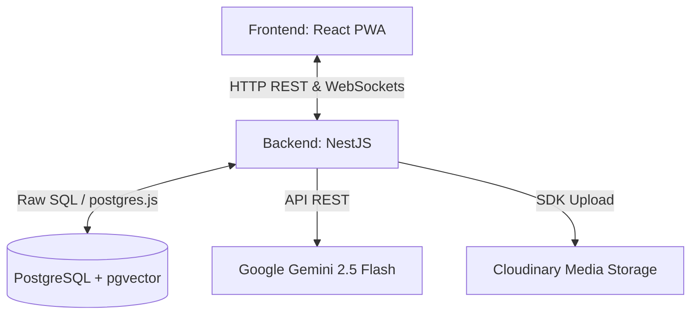
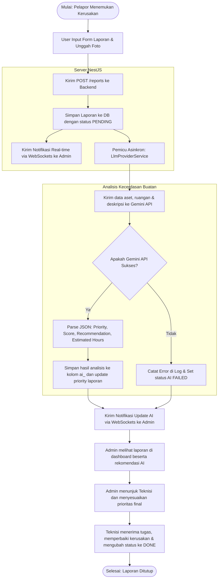
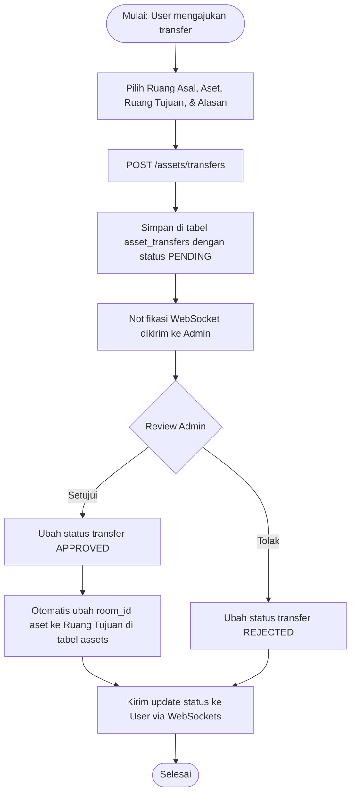

# FixMind — Arsitektur Sistem & Alur Diagram (Flowchart)

Dokumen ini menyajikan gambaran arsitektur sistem FixMind serta diagram alur (flowchart) untuk proses-proses utama di dalam aplikasi.

---

## 1. Arsitektur Sistem Global

FixMind menggunakan arsitektur Client-Server terpisah dengan rincian komponen berikut:

### Penjelasan Komponen:
- **Frontend (PWA React):** Aplikasi web progresif yang di-deploy ke peramban pengguna, mendukung mode desktop dan seluler (instalasi tanpa APK). Berkomunikasi secara real-time via Socket.io-client.
- **Backend (NestJS):** Menyediakan API Gateway, otentikasi JWT, validasi data, serta menangani koneksi Socket.io untuk siaran notifikasi real-time.
- **Database (PostgreSQL + pgvector):** Menyimpan relasi tabel data operasional serta mendukung pencarian semantik (RAG) menggunakan indeks vektor.
- **Google Gemini 2.5 Flash:** Mesin AI penilai prioritas dan kategori laporan otomatis secara asinkron.
- **Cloudinary:** Penyimpanan eksternal untuk berkas gambar kerusakan/bukti pengerjaan perbaikan.

---

## 2. Diagram Alur Siklus Laporan & Analisis AI (Flowchart)

Berikut adalah diagram alur sejak pengguna membuat laporan kerusakan hingga laporan tersebut diproses secara otomatis oleh AI dan ditindaklanjuti oleh Admin:

---

## 3. Diagram Alur Pengajuan Pemindahan Aset (Asset Transfer Flow)

Berikut adalah diagram alur untuk proses pengajuan pemindahan aset inventaris antar ruangan:

