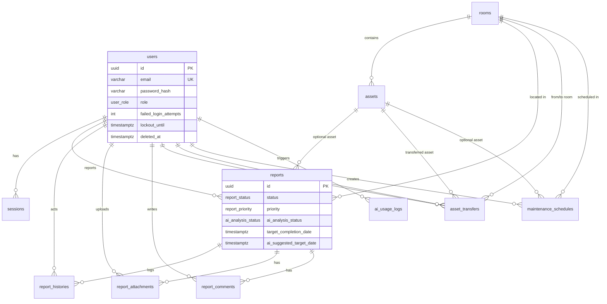

# FixMind — Database Documentation

## Design Decisions

### Why postgres.js instead of an ORM?

| Criterion | postgres.js | Prisma/TypeORM |
|-----------|---------------|----------------|
| Control | Full SQL, no magic | Abstraction leaks on complex queries |
| Performance | Minimal overhead, prepared statements | Extra layer |
| NestJS fit | Thin repository wrapper | Heavy decorators / code generation |
| Team skill | SQL is universal for 5-year maintenance | ORM version churn |

We use **tagged template literals** (`sql\`...\``) for automatic parameterization — no string concatenation.

### Why internal AiModule instead of FastAPI?

For MVP, AI needs only two HTTP calls to Gemini + optional pgvector queries. A separate Python service adds deployment complexity (second container, networking, shared auth) without benefit until custom models or vision pipelines are required. `LlmProviderService` is swappable behind an interface.

### Schema highlights

1. **Technicians are users** with `role = TECHNICIAN` — no duplicate `technicians` table.
2. **`report_histories`** — append-only audit trail for compliance and UX timeline.
3. **`report_attachments`** — separate table for Cloudinary metadata (damage vs repair photos).
4. **`ratings`** — one rating per report (`UNIQUE(report_id)`).
5. **Soft delete** on core entities; sessions use `revoked_at`.

---

## ERD



---

## Relationship Diagram

```
users ─────┬──── sessions
           ├──── reports (reporter_id)
           ├──── report_histories (actor_id)
           ├──── report_attachments (uploaded_by)
           ├──── report_comments (author_id)
           ├──── asset_transfers (requester_id)
           ├──── asset_transfers (reviewed_by)
           ├──── maintenance_schedules (created_by)
           └──── ai_usage_logs (user_id)

rooms ─────┬──── assets
           ├──── reports
           ├──── asset_transfers (from_room_id, to_room_id)
           └──── maintenance_schedules (room_id)

assets ────┬──── reports (optional)
           ├──── asset_transfers
           └──── maintenance_schedules (optional)

reports ───┬──── report_histories
           ├──── report_attachments
           └──── report_comments
```

---

## Database Dictionary

### users
| Column | Type | Description |
|--------|------|-------------|
| id | UUID | Primary key |
| email | VARCHAR(255) | Unique login email |
| password_hash | VARCHAR(255) | bcrypt hash |
| full_name | VARCHAR(150) | Display name |
| role | user_role | ADMIN, TECHNICIAN, USER |
| phone | VARCHAR(30) | Optional contact |
| avatar_url | TEXT | Cloudinary URL |
| is_active | BOOLEAN | Account enabled |
| failed_login_attempts | INT | Count of consecutive failed logins |
| lockout_until | TIMESTAMPTZ | Timestamp until account is locked |
| created_at | TIMESTAMPTZ | Created timestamp |
| updated_at | TIMESTAMPTZ | Last update |
| deleted_at | TIMESTAMPTZ | Soft delete |

### sessions
| Column | Type | Description |
|--------|------|-------------|
| id | UUID | Session ID |
| user_id | UUID | FK → users |
| refresh_token_hash | VARCHAR(255) | SHA-256 of refresh token |
| expires_at | TIMESTAMPTZ | Expiry |
| revoked_at | TIMESTAMPTZ | Logout/revoke time |

### rooms
| Column | Type | Description |
|--------|------|-------------|
| id | UUID | Primary key |
| name | VARCHAR(150) | Room name |
| code | VARCHAR(50) | Unique room code |
| floor | VARCHAR(20) | Floor label |
| building | VARCHAR(100) | Building name |
| is_active | BOOLEAN | Active flag |

### assets
| Column | Type | Description |
|--------|------|-------------|
| id | UUID | Primary key |
| room_id | UUID | FK → rooms |
| idpemda | VARCHAR(80) | Unique Pemda ID for government asset tracking |
| kode_barang | VARCHAR(50) | Unique asset code |
| nomor_register | VARCHAR(80) | Asset registration number |
| nama_barang | VARCHAR(150) | Display/item name |
| merk_type | VARCHAR(150) | Brand and type of asset |
| status | asset_status | OPERATIONAL, NEEDS_MAINTENANCE, OUT_OF_SERVICE |

### reports
| Column | Type | Description |
|--------|------|-------------|
| id | UUID | Primary key |
| reporter_id | UUID | FK → users |
| room_id | UUID | FK → rooms |
| asset_id | UUID | Optional FK → assets |
| title | VARCHAR(200) | Short summary |
| description | TEXT | Damage description |
| status | report_status | Workflow state |
| priority | report_priority | AI or manual priority |
| target_completion_date | TIMESTAMPTZ | Custom targeted completion date |
| ai_suggested_target_date | TIMESTAMPTZ | AI recommended completion date |
| ai_* | various | AI analysis fields (score, recommendation, etc.) |

### report_comments
| Column | Type | Description |
|--------|------|-------------|
| id | UUID | Primary key |
| report_id | UUID | FK → reports |
| author_id | UUID | FK → users |
| content | TEXT | Comment content (max 2000 chars) |
| created_at | TIMESTAMPTZ | Created timestamp |
| updated_at | TIMESTAMPTZ | Updated timestamp |

### asset_transfers
| Column | Type | Description |
|--------|------|-------------|
| id | UUID | Primary key |
| asset_id | UUID | FK → assets |
| requester_id | UUID | FK → users |
| from_room_id | UUID | FK → rooms |
| to_room_id | UUID | FK → rooms |
| reason | TEXT | Reason for asset movement request |
| status | asset_transfer_status | PENDING, APPROVED, REJECTED |
| reviewed_by | UUID | Optional FK → users (admin reviewer) |
| reviewed_at | TIMESTAMPTZ | Timestamp of review |
| reviewer_notes | TEXT | Feedback notes from admin review |
| created_at | TIMESTAMPTZ | Creation timestamp |
| updated_at | TIMESTAMPTZ | Last update timestamp |

### maintenance_schedules
| Column | Type | Description |
|--------|------|-------------|
| id | UUID | Primary key |
| room_id | UUID | Optional FK → rooms |
| asset_id | UUID | Optional FK → assets |
| title | VARCHAR(255) | Schedule/action title |
| description | TEXT | Detailed action description |
| frequency | maintenance_frequency | WEEKLY, MONTHLY, QUARTERLY, ANNUALLY, ONE_TIME |
| scheduled_date | DATE | Scheduled date of maintenance |
| status | maintenance_schedule_status | SCHEDULED, IN_PROGRESS, DONE, CANCELLED, OVERDUE |
| assignee_type | maintenance_assignee_type | INTERNAL, EXTERNAL_VENDOR |
| assignee_name | VARCHAR(255) | Name of internal technician or external company |
| vendor_contact_name | VARCHAR(255) | Name of contact person for external vendor |
| vendor_phone | VARCHAR(50) | Phone number of vendor |
| estimated_cost | NUMERIC(18, 2) | Cost prediction/estimation |
| notes | TEXT | Maintenance notes / results |
| created_by | UUID | Optional FK → users |
| completed_at | TIMESTAMPTZ | Completion timestamp |
| created_at | TIMESTAMPTZ | Creation timestamp |
| updated_at | TIMESTAMPTZ | Last update timestamp |

### report_histories
Append-only audit log with `action`, `old_status`, `new_status`, `metadata` JSONB.

### report_attachments
Cloudinary `public_id` + `url`, type DAMAGE | REPAIR | OTHER.

---

## Index Recommendations

| Index | Purpose |
|-------|---------|
| `idx_reports_status` | Admin dashboard filters |
| `idx_reports_reporter_id` | User history |
| `idx_reports_created_at DESC` | Recent reports list |
| `idx_sessions_user_id` | Session lookup |

| `ux_asset_transfers_pending_asset_id` (Unique) | Prevensi multiple pending transfers untuk satu aset |

---

## Database Tuning & Query Optimization Guide

Karena aplikasi ini menggunakan raw SQL tanpa abstraction ORM, optimasi kueri dan penyetelan database sangat krusial untuk menjaga performa di bawah beban kerja tinggi.


### 2. B-Tree Index untuk Filter & Pagination
Setiap kueri pelaporan (`reports`) memfilter data berdasarkan status dan tanggal serta menggunakan pengurutan terbalik (`ORDER BY created_at DESC`).
- Pastikan indeks komposit terpasang jika sering memfilter beberapa kolom sekaligus:
  ```sql
  CREATE INDEX idx_reports_filter_status_date 
  ON reports (status, created_at DESC) 
  WHERE deleted_at IS NULL;
  ```
- Selalu sertakan klausul `WHERE deleted_at IS NULL` (Partial Index) pada indeks untuk mengabaikan baris yang terhapus secara logis (*soft deleted*), menjaga ukuran indeks tetap kecil dan efisien.

### 3. Analisis Kueri dengan `EXPLAIN ANALYZE`
Jika menemukan kueri REST API yang lambat (di atas 100ms), gunakan `EXPLAIN ANALYZE` di PostgreSQL untuk menguji performa rencana kueri:
```sql
EXPLAIN ANALYZE 
SELECT * FROM reports 
WHERE status = 'PENDING' AND deleted_at IS NULL 
ORDER BY created_at DESC 
LIMIT 20;
```
Perhatikan log keluaran:
- **Sequential Scan (Seq Scan):** Menandakan database memindai seluruh baris tabel. Solusi: Buat indeks yang cocok dengan klausul `WHERE`.
- **Index Scan / Index Only Scan:** Menandakan kueri telah menggunakan indeks dengan efisien.

### 4. Connection Pooling (postgres.js)
Koneksi database dikelola menggunakan pooling bawaan `postgres.js` di `database.module.ts`.
- **Ukuran Pool Maksimal (`max`):** Secara default disetel ke 10 koneksi. Pada lingkungan produksi dengan lalu lintas tinggi, tingkatkan nilai `max` hingga 20-50 koneksi (sesuaikan dengan alokasi RAM PostgreSQL server Anda):
  ```typescript
  // database.module.ts
  const sql = postgres(DATABASE_URL, {
    max: 20, // sesuaikan jumlah koneksi pool
    idle_timeout: 30, // tutup koneksi idle setelah 30 detik
  });
  ```

---

## Migration Files

Located in `backend/migrations/`:

1. `0001_init_extensions.sql` — pgcrypto, pgvector
2. `0002_create_users_and_sessions.sql` — users, sessions
3. `0003_create_facilities.sql` — rooms, assets
4. `0004_create_reports.sql` — reports, report_histories, report_attachments, ratings
5. `0005_create_ai_tables.sql` — knowledge_chunks, ai_usage_logs
6. `0006_comments_and_maintenance.sql` — report_comments, maintenance_schedules
7. `0007_add_target_date_reports.sql` — target_completion_date di reports
8. `0008_update_asset_inventory_columns.sql` — penyesuaian kolom aset Pemda (idpemda, kode_barang, nomor_register, merk_type)
9. `0009_drop_ratings.sql` — hapus tabel ratings
10. `0010_create_asset_transfers.sql` — asset_transfers
11. `0011_remove_technician_columns.sql` — pembersihan kolom teknisi usang di reports dan drop maintenance_schedules lama
12. `0012_create_maintenance_schedules.sql` — buat ulang maintenance_schedules dengan detail vendor & biaya
13. `0013_add_failed_login_lockout.sql` — lockout login gagal di users
14. `0014_drop_knowledge_chunks.sql` — hapus tabel knowledge_chunks

Run migrations with: `bun run migrate` (configured with `DATABASE_URL` in `.env`).

