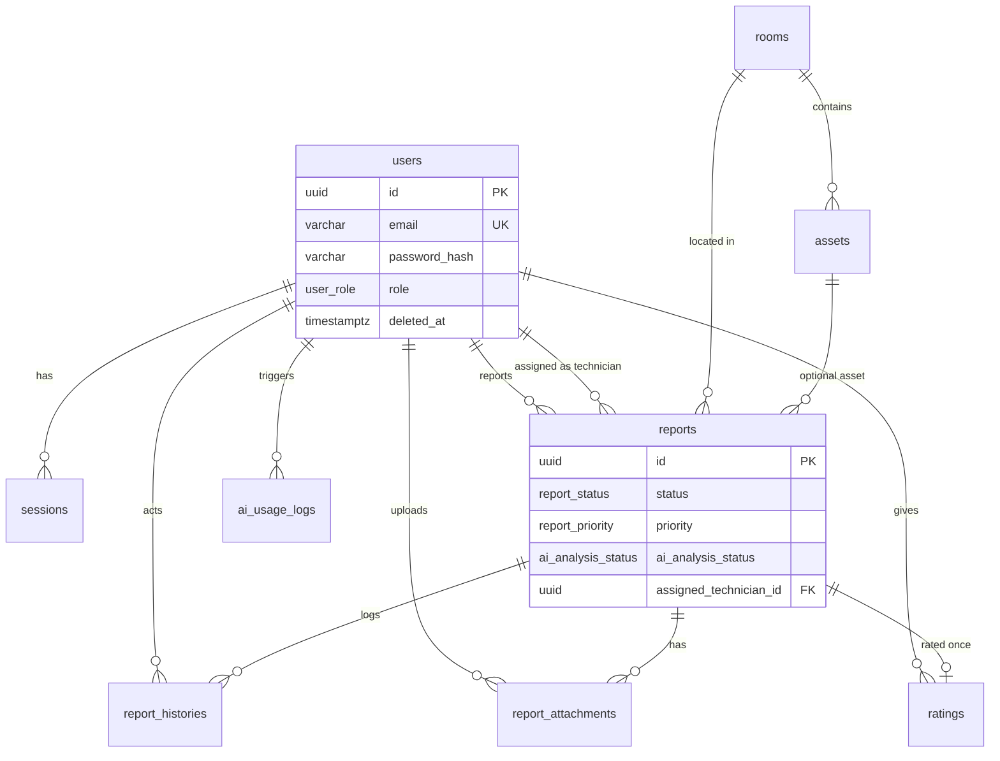

# FixMind — Database Documentation

## Design Decisions

### Why postgres.js instead of an ORM?

| Criterion | postgres.js | Prisma/TypeORM |
|-----------|---------------|----------------|
| Control | Full SQL, no magic | Abstraction leaks on complex queries |
| Performance | Minimal overhead, prepared statements | Extra layer |
| NestJS fit | Thin repository wrapper | Heavy decorators / code generation |
| Team skill | SQL is universal for 5-year maintenance | ORM version churn |

We use **tagged template literals** (`sql\`...\``) for automatic parameterization — no string concatenation.

### Why internal AiModule instead of FastAPI?

For MVP, AI needs only two HTTP calls to Gemini + optional pgvector queries. A separate Python service adds deployment complexity (second container, networking, shared auth) without benefit until custom models or vision pipelines are required. `LlmProviderService` is swappable behind an interface.

### Schema highlights

1. **Technicians are users** with `role = TECHNICIAN` — no duplicate `technicians` table.
2. **`report_histories`** — append-only audit trail for compliance and UX timeline.
3. **`report_attachments`** — separate table for Cloudinary metadata (damage vs repair photos).
4. **`ratings`** — one rating per report (`UNIQUE(report_id)`).
5. **`knowledge_chunks`** — pgvector for future RAG chatbot; embedding dimension 768 (Gemini).
6. **Soft delete** on core entities; sessions use `revoked_at`.

---

## ERD



---

## Relationship Diagram

```
users ─────┬──── sessions
           ├──── reports (reporter_id)
           ├──── reports (assigned_technician_id)
           ├──── report_histories (actor_id)
           ├──── report_attachments (uploaded_by)
           └──── ratings (user_id)

rooms ─────┬──── assets
           └──── reports

reports ───┬──── report_histories
           ├──── report_attachments
           └──── ratings (1:1)

knowledge_chunks (standalone, vector index)
ai_usage_logs ─── users (optional)
```

---

## Database Dictionary

### users
| Column | Type | Description |
|--------|------|-------------|
| id | UUID | Primary key |
| email | VARCHAR(255) | Unique login email |
| password_hash | VARCHAR(255) | bcrypt hash |
| full_name | VARCHAR(150) | Display name |
| role | user_role | ADMIN, TECHNICIAN, USER |
| phone | VARCHAR(30) | Optional contact |
| avatar_url | TEXT | Cloudinary URL |
| is_active | BOOLEAN | Account enabled |
| created_at | TIMESTAMPTZ | Created timestamp |
| updated_at | TIMESTAMPTZ | Last update |
| deleted_at | TIMESTAMPTZ | Soft delete |

### sessions
| Column | Type | Description |
|--------|------|-------------|
| id | UUID | Session ID |
| user_id | UUID | FK → users |
| refresh_token_hash | VARCHAR(255) | SHA-256 of refresh token |
| expires_at | TIMESTAMPTZ | Expiry |
| revoked_at | TIMESTAMPTZ | Logout/revoke time |

### rooms
| Column | Type | Description |
|--------|------|-------------|
| id | UUID | Primary key |
| name | VARCHAR(150) | Room name |
| code | VARCHAR(50) | Unique room code |
| floor | VARCHAR(20) | Floor label |
| building | VARCHAR(100) | Building name |
| is_active | BOOLEAN | Active flag |

### assets
| Column | Type | Description |
|--------|------|-------------|
| id | UUID | Primary key |
| room_id | UUID | FK → rooms |
| asset_code | VARCHAR(50) | Unique asset identifier |
| category | VARCHAR(80) | e.g. AC, Projector |
| status | asset_status | OPERATIONAL, NEEDS_MAINTENANCE, OUT_OF_SERVICE |

### reports
| Column | Type | Description |
|--------|------|-------------|
| id | UUID | Primary key |
| reporter_id | UUID | FK → users |
| room_id | UUID | FK → rooms |
| asset_id | UUID | Optional FK → assets |
| title | VARCHAR(200) | Short summary |
| description | TEXT | Damage description |
| status | report_status | Workflow state |
| priority | report_priority | AI or manual priority |
| ai_* | various | AI analysis fields |
| assigned_technician_id | UUID | FK → users (technician) |

### report_histories
Append-only audit log with `action`, `old_status`, `new_status`, `metadata` JSONB.

### report_attachments
Cloudinary `public_id` + `url`, type DAMAGE | REPAIR | OTHER.

### ratings
`score` 1–5, one per report.

### knowledge_chunks
RAG content with `embedding vector(768)` and HNSW index.

---

## Index Recommendations

| Index | Purpose |
|-------|---------|
| `idx_reports_status` | Admin dashboard filters |
| `idx_reports_reporter_id` | User history |
| `idx_reports_assigned_technician` | Technician inbox |
| `idx_reports_created_at DESC` | Recent reports list |
| `idx_sessions_user_id` | Session lookup |
| `idx_knowledge_chunks_embedding` (HNSW) | Vector similarity search |

---

## Migration Files

Located in `backend/migrations/`:

1. `0001_init_extensions.sql` — pgcrypto, pgvector
2. `0002_create_users_and_sessions.sql`
3. `0003_create_facilities.sql`
4. `0004_create_reports.sql`
5. `0005_create_ai_tables.sql`

Run with: `bun run migrate` (after configuring `DATABASE_URL`).
