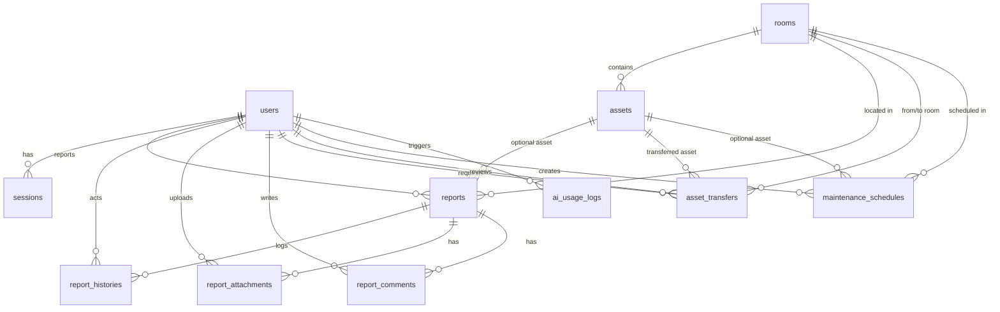

# FixMind — Dokumentasi Database & Skema Relasional

Dokumen ini menjelaskan keputusan desain arsitektur database, Diagram Relasi Entitas (ERD), kamus data (*Data Dictionary*), indeks performa, serta daftar migrasi SQL pada aplikasi **E-Lapor DPRD (FixMind)**.

---

## Keputusan Desain Arsitektur Database (Design Decisions)

### Mengapa Menggunakan `postgres.js` Dibandingkan ORM Heavy (Prisma/TypeORM)?

| Kriteria | postgres.js | Prisma / TypeORM |
|----------|-------------|------------------|
| **Kontrol** | Full SQL murni, tanpa manipulasi tersembunyi | Abstraksi ber berisiko melambat pada kueri kompleks |
| **Performa** | Overhead minimal, *prepared statements* native | Lapisan abstraksi tambahan yang memperlambat kueri |
| **Kesesuaian NestJS** | Lapisan repositori yang tipis & efisien | Decorator berat & kode berukuran besar |
| **Keterampilan Tim** | Standar SQL universal yang mudah dirawat dalam jangka panjang | Mengikuti churn versi ORM yang sering berubah |

Kami menggunakan **tagged template literals** (`sql\`...\``) bawaan `postgres.js` untuk otomatisasi *parameterized queries* guna mencegah celah keamanan SQL Injection.

### Mengapa Menggunakan Modul AI Internal Dibandingkan FastAPI/Python?

Untuk kebutuhan aplikasi, modul AI hanya membutuhkan panggilan HTTP asinkron ke API Gemini dan kueri `pgvector`. Layanan Python terpisah akan menambah kompleksitas *deployment* (container kedua, networking, shared auth) tanpa memberikan manfaat signifikan. Antarmuka `LlmProviderService` dirancang agar dapat diisolasi dan di-extract ke microservice Python di masa mendatang jika dibutuhkan *custom vision model*.

---

## Diagram Relasi Entitas (ERD)

```mermaid
erDiagram
    users ||--o{ sessions : has
    users ||--o{ reports : reports
    users ||--o{ report_histories : acts
    users ||--o{ report_attachments : uploads
    users ||--o{ report_comments : writes
    users ||--o{ asset_transfers : requests
    users ||--o{ asset_transfers : reviews
    users ||--o{ maintenance_schedules : creates
    users ||--o{ ai_usage_logs : triggers

    rooms ||--o{ assets : contains
    rooms ||--o{ reports : "located in"
    rooms ||--o{ asset_transfers : "from/to room"
    rooms ||--o{ maintenance_schedules : "scheduled in"

    assets ||--o{ reports : "optional asset"
    assets ||--o{ asset_transfers : "transferred asset"
    assets ||--o{ maintenance_schedules : "optional asset"

    reports ||--o{ report_histories : logs
    reports ||--o{ report_attachments : has
    reports ||--o{ report_comments : has
```

---

## Kamus Data (Data Dictionary)

### 1. `users` (Tabel Akun Pengguna)
| Kolom | Tipe Data | Deskripsi |
|-------|-----------|-----------|
| `id` | UUID | Primary key (UUID v4) |
| `email` | VARCHAR(255) | Email login unik |
| `password_hash` | VARCHAR(255) | Hash kata sandi bcrypt |
| `full_name` | VARCHAR(150) | Nama lengkap pengguna |
| `is_admin` | BOOLEAN | Peran pengguna: `ADMIN` (true) atau `USER` (false) |
| `phone` | VARCHAR(30) | Nomor telepon opsional |
| `avatar_url` | TEXT | URL foto profil Cloudinary |
| `is_active` | BOOLEAN | Status aktif akun |
| `failed_login_attempts` | INT | Jumlah percobaan login gagal berturut-turut |
| `lockout_until` | TIMESTAMPTZ | Waktu kunci akun jika gagal 5x |
| `created_at` | TIMESTAMPTZ | Waktu pendaftaran |
| `updated_at` | TIMESTAMPTZ | Waktu pembaruan terakhir |
| `deleted_at` | TIMESTAMPTZ | Waktu *soft delete* |

### 2. `sessions` (Tabel Sesi Login)
| Kolom | Tipe Data | Deskripsi |
|-------|-----------|-----------|
| `id` | UUID | Session ID |
| `user_id` | UUID | FK → `users.id` |
| `refresh_token_hash` | VARCHAR(255) | Hash SHA-256 dari Refresh Token |
| `expires_at` | TIMESTAMPTZ | Tanggal kedaluwarsa sesi |
| `revoked_at` | TIMESTAMPTZ | Waktu pencabutan sesi / logout |

### 3. `rooms` (Tabel Ruangan DPRD)
| Kolom | Tipe Data | Deskripsi |
|-------|-----------|-----------|
| `id` | UUID | Primary key |
| `name` | VARCHAR(150) | Nama ruangan |
| `code` | VARCHAR(50) | Kode unik ruangan |
| `floor` | VARCHAR(20) | Label lantai gedung |
| `building` | VARCHAR(100) | Nama gedung |
| `is_active` | BOOLEAN | Bendera aktif ruangan |

### 4. `assets` (Tabel Aset Inventaris)
| Kolom | Tipe Data | Deskripsi |
|-------|-----------|-----------|
| `id` | UUID | Primary key |
| `room_id` | UUID | FK → `rooms.id` |
| `idpemda` | VARCHAR(80) | ID Pemda unik inventaris |
| `kode_barang` | VARCHAR(50) | Kode barang inventaris |
| `nomor_register` | VARCHAR(80) | Nomor register aset |
| `nama_barang` | VARCHAR(150) | Nama aset / barang |
| `merk_type` | VARCHAR(150) | Merk dan tipe aset |
| `status` | asset_status | Enum: `OPERATIONAL`, `NEEDS_MAINTENANCE`, `OUT_OF_SERVICE` |

### 5. `reports` (Tabel Tiket Laporan Masalah)
| Kolom | Tipe Data | Deskripsi |
|-------|-----------|-----------|
| `id` | UUID | Primary key |
| `reporter_id` | UUID | FK → `users.id` (Pelapor) |
| `room_id` | UUID | FK → `rooms.id` |
| `asset_id` | UUID | Opsional FK → `assets.id` |
| `title` | VARCHAR(200) | Judul ringkas laporan |
| `description` | TEXT | Rincian deskripsi kerusakan |
| `status` | report_status | Enum: `PENDING`, `IN_PROGRESS`, `DONE`, `REJECTED` |
| `priority` | report_priority | Enum: `LOW`, `MEDIUM`, `HIGH`, `CRITICAL` |
| `target_completion_date` | TIMESTAMPTZ | Target tanggal penyelesaian manual |
| `ai_suggested_target_date` | TIMESTAMPTZ | Rekomendasi tanggal penyelesaian dari AI |
| `ai_*` | Beragam | Kolom analisis AI (score, recommendation, estimated_hours) |

### 6. `asset_transfers` (Tabel Pengajuan Transfer Aset)
| Kolom | Tipe Data | Deskripsi |
|-------|-----------|-----------|
| `id` | UUID | Primary key |
| `asset_id` | UUID | FK → `assets.id` |
| `requester_id` | UUID | FK → `users.id` |
| `from_room_id` | UUID | FK → `rooms.id` |
| `to_room_id` | UUID | FK → `rooms.id` |
| `reason` | TEXT | Alasan pengajuan pemindahan aset |
| `status` | asset_transfer_status | Enum: `PENDING`, `APPROVED`, `REJECTED` |
| `reviewed_by` | UUID | Opsional FK → `users.id` (Admin reviewer) |
| `reviewed_at` | TIMESTAMPTZ | Waktu peninjauan admin |
| `reviewer_notes` | TEXT | Catatan umpan balik admin |

### 7. `maintenance_schedules` (Tabel Agenda Pemeliharaan Rutin)
| Kolom | Tipe Data | Deskripsi |
|-------|-----------|-----------|
| `id` | UUID | Primary key |
| `room_id` | UUID | Opsional FK → `rooms.id` |
| `asset_id` | UUID | Opsional FK → `assets.id` |
| `title` | VARCHAR(255) | Judul agenda pemeliharaan |
| `description` | TEXT | Deskripsi rincian pengerjaan |
| `frequency` | maintenance_frequency | Enum: `WEEKLY`, `MONTHLY`, `QUARTERLY`, `ANNUALLY`, `ONE_TIME` |
| `scheduled_date` | DATE | Tanggal pelaksanaan jadwal |
| `status` | maintenance_schedule_status | Enum: `SCHEDULED`, `IN_PROGRESS`, `DONE`, `CANCELLED`, `OVERDUE` |
| `assignee_type` | maintenance_assignee_type | Enum: `INTERNAL`, `EXTERNAL_VENDOR` |
| `assignee_name` | VARCHAR(255) | Nama teknisi internal / perusahaan vendor |
| `vendor_contact_name` | VARCHAR(255) | Nama kontak person vendor |
| `vendor_phone` | VARCHAR(50) | Nomor telepon vendor |
| `estimated_cost` | NUMERIC(18, 2) | Estimasi / realisasi biaya pemeliharaan |

---

## Indeks & Optimasi Kueri (Database Tuning)

- **Partial Indexing:** Menggunakan `WHERE deleted_at IS NULL` pada indeks untuk mengabaikan baris yang terhapus secara logis (*soft deleted*), menjaga ukuran indeks tetap kecil.
- **Index Recommendations:**
  - `idx_reports_status_created`: Untuk penyaringan & pengurutan cepat di dasbor admin.
  - `ux_asset_transfers_pending_asset_id`: Indeks Unik untuk mencegah duplikasi pengajuan transfer aktif pada aset yang sama.
- **Connection Pooling:** Dikelola via `postgres.js` di `database.module.ts` dengan ambang `max: 20` koneksi.

---

## Riwayat Berkas Migrasi SQL (`backend/migrations/`)

1. `0001_init_extensions.sql` — pgcrypto, pgvector
2. `0002_create_users_and_sessions.sql` — users, sessions
3. `0003_create_facilities.sql` — rooms, assets
4. `0004_create_reports.sql` — reports, report_histories, report_attachments
5. `0005_create_ai_tables.sql` — ai_usage_logs
6. `0006_comments_and_maintenance.sql` — report_comments, maintenance_schedules
7. `0007_add_target_date_reports.sql` — target_completion_date di reports
8. `0008_update_asset_inventory_columns.sql` — penyesuaian kolom aset Pemda (`idpemda`, `kode_barang`, `nomor_register`, `merk_type`)
9. `0009_drop_ratings.sql` — pembersihan tabel ratings usang
10. `0010_create_asset_transfers.sql` — asset_transfers
11. `0011_remove_technician_columns.sql` — pembersihan kolom teknisi usang
12. `0012_create_maintenance_schedules.sql` — pembaruan maintenance_schedules dengan detail vendor & biaya
13. `0013_add_failed_login_lockout.sql` — kolom lockout login gagal di users
14. `0014_drop_knowledge_chunks.sql` — pembersihan struktur sementara

Jalankan seluruh migrasi dengan perintah: `bun run migrate` (dikonfigurasi via `DATABASE_URL` pada file `.env`).
